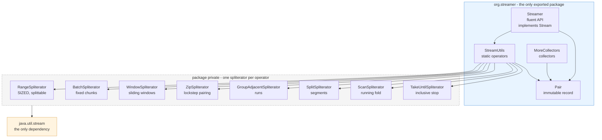
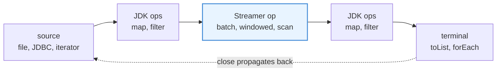

<h1 align="center">Streamer</h1>

<p align="center">
  <b>The stream operators <code>java.util.stream</code> forgot.</b><br>
  Zip, batch, sliding windows, running folds, sorted merges. Lazy, tested, zero dependencies.
</p>

<p align="center">
  <a href="https://github.com/alxkm/streamer/actions/workflows/ci.yml"></a>
  <a href="https://github.com/alxkm/streamer/actions/workflows/codeql.yml"></a>
  <a href="https://jitpack.io/#alxkm/streamer"></a>
  <a href="https://alxkm.github.io/streamer/"></a>
  
  
  <a href="LICENSE"></a>
</p>

---

## The problem

Java's Stream API is excellent at map, filter and reduce, and silent about everything else. Pair two
streams positionally, cut a stream into chunks of 500 for a batch insert, compute a moving average,
emit running totals, merge two sorted files without loading either one - and you are writing a
`Spliterator` by hand. Again.

Those spliterators are already written here, with the edge cases they usually get wrong: the short
tail, the unequal lengths, the close handler that leaks the underlying file, the negative range that
splits into billions of elements that were never in it.

```java
// Batch 10 million rows into inserts of 500. One batch is in memory at a time.
try (Stream<Row> rows = repository.streamAll()) {
    Streamer.of(rows).batch(500).forEach(repository::insertAll);
}

// Seven day moving average over a price series.
Streamer.of(prices)
        .windowed(7)
        .mapToDouble(week -> week.stream().mapToDouble(Double::doubleValue).average().orElseThrow())
        .forEach(System.out::println);

// Merge two sorted exports without holding either in memory.
try (Stream<Event> a = Files.lines(left).map(Event::parse);
     Stream<Event> b = Files.lines(right).map(Event::parse)) {
    Streamer.of(a).mergeSortedWith(b, comparing(Event::timestamp)).forEach(writer::write);
}
```

## Install

Releases are built straight from the Git tag by [JitPack](https://jitpack.io/#alxkm/streamer), so
there is nothing to sign up for.

<details open>
<summary><b>Gradle</b></summary>

```groovy
repositories {
    mavenCentral()
    maven { url 'https://jitpack.io' }
}

dependencies {
    implementation 'com.github.alxkm:streamer:2.0.0'
}
```
</details>

<details>
<summary><b>Gradle (Kotlin DSL)</b></summary>

```kotlin
repositories {
    mavenCentral()
    maven("https://jitpack.io")
}

dependencies {
    implementation("com.github.alxkm:streamer:2.0.0")
}
```
</details>

<details>
<summary><b>Maven</b></summary>

```xml
<repositories>
    <repository>
        <id>jitpack.io</id>
        <url>https://jitpack.io</url>
    </repository>
</repositories>

<dependency>
    <groupId>com.github.alxkm</groupId>
    <artifactId>streamer</artifactId>
    <version>2.0.0</version>
</dependency>
```
</details>

Requires **Java 17 or newer**. The jar is a JPMS module named `org.streamer`, so it drops onto the
module path as well as the class path. API docs:
**[alxkm.github.io/streamer](https://alxkm.github.io/streamer/)**.

## Two ways to call it

`Streamer` implements `Stream`, so the operators chain in the order the data flows and mix freely
with the JDK ones:

```java
Streamer.of(source)
        .filter(Row::isValid)
        .windowed(3)
        .batch(2)
        .toList();
```

`StreamUtils` is the same set of operators as plain static methods, for when you already have a
stream in hand and want one thing done to it:

```java
StreamUtils.batch(rows, 500)
```

Both build identical pipelines. `Streamer` adds no state of its own; it delegates.

## 60 second tour

```java
import org.streamer.Streamer;
import org.streamer.MoreCollectors;
import org.streamer.Pair;

// Pair two streams positionally; stops at the shorter one.
Streamer.of("ann", "bob").zip(Stream.of(91, 78)).toList();
                                  // [Pair[first=ann, second=91], Pair[first=bob, second=78]]

// Or combine on the fly and skip the Pair allocation.
Streamer.of(names).zip(scores, Score::new);

// Number the elements.
Streamer.of(lines).zipWithIndex().map(p -> (p.first() + 1) + ": " + p.second());

// Running totals: reduce that shows its work.
Streamer.of(10, 20, 30).scan(0, Integer::sum).toList();          // [0, 10, 30, 60]

// Collapse runs of adjacent equal elements.
Streamer.of(1, 1, 2, 3, 3, 3).groupAdjacent(Integer::equals).toList();
                                                                 // [[1, 1], [2], [3, 3, 3]]

// Read to the terminator, inclusive. Nothing past it is pulled.
Streamer.of(pages).takeUntil(Page::isLast);

// Round-robin two sources.
Streamer.of("a", "c").interleaveWith(Stream.of("b", "d")).toList();      // [a, b, c, d]

// Escape hatch for anything this class does not have, without leaving the chain.
Streamer.of(source).pipe(myLibrary::dedupe).batch(100);

// Collectors the JDK is missing.
words.collect(MoreCollectors.toFrequencyMap());          // {the=12, and=7, ...}
prices.collect(MoreCollectors.minMax(naturalOrder()));   // Optional[Pair[first=1.02, second=98.4]]
```

## What each operator does

The marble diagrams below read left to right; each row is a stream over time.

<table>
<tr><th width="180">Operator</th><th>Shape</th></tr>

<tr><td><code>zip(a, b)</code><br><sub>pair positionally</sub></td><td>

```text
a ──a────b────c──►
b ──1────2──►
      ▼
  ──(a,1)──(b,2)──►                 stops at the shorter input
```
</td></tr>

<tr><td><code>batch(s, 3)</code><br><sub>fixed size chunks</sub></td><td>

```text
s ──1──2──3──4──5──6──7──8──►
      ▼
  ──[1,2,3]──[4,5,6]──[7,8]──►      the tail is kept, even if short
```
</td></tr>

<tr><td><code>windowed(s, 3)</code><br><sub>sliding window</sub></td><td>

```text
s ──1──2──3──4──5──►
      ▼
  ──[1,2,3]──[2,3,4]──[3,4,5]──►    add a step to skip: windowed(s, 3, 2)
```
</td></tr>

<tr><td><code>scan(s, 0, +)</code><br><sub>running fold</sub></td><td>

```text
s ──────1────2────3──►
      ▼
  ──0───1────3────6──►              reduce returns 6; scan returns the path there
```
</td></tr>

<tr><td><code>groupAdjacent</code><br><sub>run-length grouping</sub></td><td>

```text
s ──a──a──b──c──c──c──►
      ▼
  ──[a,a]──[b]──[c,c,c]──►          keeps encounter order, buffers one run
```
</td></tr>

<tr><td><code>splitBy</code><br><sub>cut at delimiters</sub></td><td>

```text
s ──a──b──/──c──/──d──►
      ▼      (x == /)
  ──[a,b]──[c]──[d]──►             delimiters are dropped, segments may be empty
```
</td></tr>

<tr><td><code>mergeSorted</code><br><sub>ordered merge</sub></td><td>

```text
a ──1──4──7──►
b ──2──3──8──►
      ▼
  ──1──2──3──4──7──8──►             holds two elements total, ties go left
```
</td></tr>

<tr><td><code>interleave</code><br><sub>round robin</sub></td><td>

```text
a ──1──3──5──►
b ──2──4──►
      ▼
  ──1──2──3──4──5──►                the longer tail is appended
```
</td></tr>

<tr><td><code>takeUntil</code><br><sub>inclusive stop</sub></td><td>

```text
s ──1──2──3──4──5──►
      ▼   (x == 3)
  ──1──2──3──|                      takeWhile stops before, takeUntil stops after
```
</td></tr>
</table>

## Full API

Every operator exists twice: as a `Streamer` instance method and as a `StreamUtils` static method.
The fluent column is what you chain, the static column is what it calls.

### Creation

| Fluent | Static | Does |
| --- | --- | --- |
| `Streamer.of(stream)` | - | Wrap an existing stream |
| `Streamer.of(a, b, c)` | - | Start from varargs |
| `Streamer.from(iterable)` | `asStream(Iterable)` | Stream over anything iterable |
| `Streamer.from(iterator)` | `asStream(Iterator)` | Lazy stream over an iterator |
| - | `asStream(Enumeration)` | Bridge for pre-collections APIs such as `ZipFile.entries()` |
| `Streamer.empty()` | - | Empty stream |
| `Streamer.range(a, b)` | `range(int, int)` | Boxed `[a, b)` that keeps `SIZED`/`SUBSIZED` and splits evenly |
| - | `ofNullable(T)` | One element, or empty when the value is `null` |
| `.concatWith(other)` | `concat(Stream...)` | Flat concatenation, no left-leaning `Stream.concat` tree |

### Filtering

| Fluent | Static | Does |
| --- | --- | --- |
| `.filterByType(Class)` | `filterByType(Stream, Class)` | Keep instances of a type and cast them |
| `.filterNot(Predicate)` | `filterNot(Stream, Predicate)` | The complement of `filter` |
| `.distinctBy(Function)` | `distinctBy(Stream, Function)` | First element per key |
| - | `distinctByKey(Function)` | The same thing as a reusable `Predicate` for `filter` |
| `.takeUntil(Predicate)` | `takeUntil(Stream, Predicate)` | Stop *after* the first match |

### Reshaping

| Fluent | Static | Does |
| --- | --- | --- |
| `.zip(other)` | `zip(Stream, Stream)` | Pair positionally |
| `.zip(other, BiFunction)` | `zip(Stream, Stream, BiFunction)` | Pair and combine in one step |
| `.zipWithIndex()` | `zipWithIndex(Stream)` | Pair each element with its position |
| `.batch(int)` | `batch(Stream, int)` | Fixed size chunks, short tail kept |
| `.windowed(int)` | `windowed(Stream, int)` | Sliding windows, step 1 |
| `.windowed(int, int)` | `windowed(Stream, int, int)` | Sliding windows with an explicit step |
| `.groupAdjacent(BiPredicate)` | `groupAdjacent(Stream, BiPredicate)` | Group consecutive related elements |
| `.groupAdjacentBy(Function)` | `groupAdjacentBy(Stream, Function)` | The same, keyed by a property |
| `.splitBy(Predicate)` | `splitBy(Stream, Predicate)` | Cut into segments at delimiter elements |
| `.scan(seed, BiFunction)` | `scan(Stream, R, BiFunction)` | Running fold, seed first |
| `.flatMapToPair(Function)` | `flatMapToPair(Stream, Function)` | Expand, keeping each source element alongside |
| `.pipe(Function)` | - | Apply any stream transform without leaving the chain |

### Merging and conversion

| Fluent | Static | Does |
| --- | --- | --- |
| `.interleaveWith(other)` | `interleave(Stream, Stream)` | Alternate between two sources |
| `.mergeSortedWith(other, cmp)` | `mergeSorted(Stream, Stream, Comparator)` | Stable merge of two sorted streams |
| - | `arrayToCollection(Supplier, T[])` | Array into a collection of your choosing |
| - | `arrayToCollection(Class, T[])` | Same, when the type is only known at runtime |

### `MoreCollectors`

| Collector | Does |
| --- | --- |
| `unique()` | Distinct elements as a list, first-appearance order; composes downstream of `groupingBy` |
| `toFrequencyMap()` | Element to occurrence count |
| `minMax(Comparator)` | Smallest and largest in one pass, as `Optional<Pair<T, T>>` |
| `toLinkedMap(k, v)` | Ordered map that names the key on a duplicate |

### `Pair`

An immutable record with `first()` and `second()`, plus `of`, `fromEntry`, `toEntry`, `swap`,
`mapFirst`, `mapSecond`, `fold` and `comparing`. `null` is allowed in either slot.

## How it fits together



Every operator is one spliterator wrapped in a stream. That is what keeps them lazy: the pipeline
pulls one element at a time, nothing is materialised, and the operators compose with the JDK's own.



## Things worth knowing

**Laziness.** Nothing is consumed until a terminal operation runs, and no operator pulls further
than it has to. `zip` never touches the surplus of the longer input; `takeUntil` stops at the match.
Infinite sources are fine.

**Closing.** Each derived stream keeps the close handler of its source, so try-with-resources still
works end to end:

```java
try (Stream<String> lines = Files.lines(path)) {
    Streamer.of(lines).batch(1000).forEach(this::index);
}   // the file handle is released here
```

**Parallelism.** `range` keeps `SIZED` and `SUBSIZED`, so it splits evenly; measured, it lands
within a few percent of `IntStream.range(..).boxed()`, which is the point - it is a correct
splittable range, not a faster one. `distinctByKey` is backed by a concurrent set and is safe on a
parallel stream. The order-dependent operators - `zip`, `batch`,
`windowed`, `scan`, `interleave`, `mergeSorted`, `groupAdjacent`, `zipWithIndex` - do not split;
putting one in a pipeline parallelises only the stages after it. The Javadoc says so on each method.

**Memory.** The buffering operators buffer exactly as much as they must: `batch` one batch,
`windowed` one window, `groupAdjacent` one run, `mergeSorted` two elements. Nothing collects the
whole stream behind your back.

**Nulls.** Every public method rejects `null` arguments with a `NullPointerException` that names the
parameter. Null *elements* are fine everywhere, including `mergeSorted` when the comparator accepts
them, for example `Comparator.nullsFirst(naturalOrder())`.

## Recipes

Each of these is a real task, and each one is covered by a test in `ReadmeExamplesTest`.

<details open>
<summary><b>Bulk insert without loading the table into memory</b></summary>

```java
try (Stream<Row> rows = repository.streamAll()) {
    Streamer.of(rows).batch(1_000).forEach(repository::insertAll);
}
```
One batch is live at a time, whatever the row count. The file or cursor behind `rows` is closed on
the way out.
</details>

<details>
<summary><b>Parse records separated by blank lines</b></summary>

```java
try (Stream<String> lines = Files.lines(path)) {
    List<Record> records = Streamer.of(lines)
            .splitBy(String::isBlank)
            .filter(not(List::isEmpty))
            .map(Record::parse)
            .toList();
}
```
</details>

<details>
<summary><b>Collapse a log into runs of the same level</b></summary>

```java
Streamer.of(events)
        .groupAdjacentBy(Event::level)
        .map(run -> run.size() == 1
                ? run.get(0).message()
                : run.size() + "x " + run.get(0).message())
        .forEach(System.out::println);
```
</details>

<details>
<summary><b>Moving average over a price series</b></summary>

```java
double[] sevenDay = Streamer.of(prices)
        .windowed(7)
        .mapToDouble(w -> w.stream().mapToDouble(Double::doubleValue).average().orElseThrow())
        .toArray();
```
</details>

<details>
<summary><b>Running balance from a ledger</b></summary>

```java
List<Money> balances = Streamer.of(entries)
        .scan(Money.ZERO, (balance, entry) -> balance.plus(entry.amount()))
        .toList();
```
`reduce` gives you the closing balance; `scan` gives you every balance along the way.
</details>

<details>
<summary><b>Merge two sorted exports, neither of which fits in memory</b></summary>

```java
try (Stream<Event> a = Files.lines(left).map(Event::parse);
     Stream<Event> b = Files.lines(right).map(Event::parse)) {
    Streamer.of(a)
            .mergeSortedWith(b, comparing(Event::timestamp))
            .forEach(writer::write);
}
```
Two elements are held at a time, one from each side.
</details>

<details>
<summary><b>Consume a paginated API until the last page</b></summary>

```java
Stream<Page> pages = Stream.iterate(client.firstPage(), client::nextPage);

List<Item> items = Streamer.of(pages)
        .takeUntil(Page::isLast)
        .flatMap(page -> page.items().stream())
        .toList();
```
Nothing past the terminator page is ever requested.
</details>

<details>
<summary><b>Number the lines of a file for an error message</b></summary>

```java
String numbered = Streamer.of(lines)
        .zipWithIndex()
        .map(p -> (p.first() + 1) + " | " + p.second())
        .collect(joining("\n"));
```
</details>

<details>
<summary><b>First entry per key, keeping encounter order</b></summary>

```java
List<Person> onePerCity = Streamer.of(people).distinctBy(Person::city).toList();
```
`Collectors.toMap(Person::city, identity(), (first, second) -> first)` does the same thing and
loses the order.
</details>

## Performance

Numbers from `./gradlew jmh` on an AMD Ryzen 5 3600, Temurin 17.0.16, 10 000 elements, average
time per operation, lower is better. Your absolute numbers will differ; the ratios are the point.

| Task | Streamer | Hand written alternative | |
| --- | --- | --- | --- |
| Concatenate 1 000 streams | **35 µs** | 4 289 µs - nested `Stream.concat` | **123x faster** |
| Fluent chain vs static calls | 190 µs | 202 µs - `StreamUtils` directly | same, within noise |
| Parallel sum over a boxed range | 38 µs | 36 µs - `IntStream.range().boxed()` | same |
| `batch` into chunks of 100 | 68 µs | 42 µs - hand rolled iterator loop | 1.6x slower |
| `zip` two 10 000 element lists | 130 µs | 105 µs - index arithmetic over both | 1.2x slower |
| `windowed`, size 10, over a stream | 2 019 µs | 1 900 µs - hand rolled deque | 1.1x slower |
| `windowed`, size 10, over a `List` | 2 019 µs | 38 µs - `subList` views | **53x slower** |

What this says, honestly:

- **`concat` is the one big win.** Nested `Stream.concat` builds a deep pipeline, and at a thousand
  streams it costs two orders of magnitude. If you concatenate more than a handful of streams, this
  matters; the JDK javadoc warns about it too.
- **The fluent wrapper is free.** `Streamer` and `StreamUtils` land on top of each other, which is
  what "it delegates and adds no state" is supposed to mean.
- **`batch` and `zip` cost 20 to 60 percent over a hand written loop.** That buys laziness,
  immutable output, close propagation, and working on any stream rather than on an in-memory list.
  For a pipeline whose real work is a database insert or a parse, the difference disappears.
- **If your data is already a random access `List`, `windowed` is the wrong tool.** `subList`
  returns views and copies nothing, so it wins by 50x and always will. Reach for `windowed` when
  the source is a stream, a file or anything that will not fit in memory; against a like for like
  hand written buffer over a stream it is within 6 percent.

The benchmark that produced this table is in [`src/jmh`](src/jmh/java/org/streamer/OperatorBenchmark.java),
and it doubles as a guard against plausible-looking optimisations: hoisting the per-element
`Consumer` in `BatchSpliterator` into a field, which looks like an obvious allocation win, measured
1.75x **slower**, so the code says so in a comment.

## Why not something else

### JDK 24 gatherers

JDK 24 finalised `Stream.gather()` and `Gatherers` (JEP 485). Three operators here have a gatherer
equivalent:

| Streamer | JDK 24 |
| --- | --- |
| `batch(s, n)` | `s.gather(Gatherers.windowFixed(n))` |
| `windowed(s, n)` | `s.gather(Gatherers.windowSliding(n))` |
| `scan(s, seed, f)` | `s.gather(Gatherers.scan(() -> seed, f))` - the JDK version does not emit the seed |

Two reasons this library still exists. It runs on **Java 17**, which is where most projects actually
are. And the rest of the set has no gatherer at all: `zip`, `zipWithIndex`, `mergeSorted`,
`interleave`, `groupAdjacent`, `takeUntil`, `distinctBy`, `filterByType`, and `windowed` with a step.

If you are on 24 or newer and only need fixed or sliding windows, use `Gatherers`. That is the JDK's
job, not this library's.

### Guava, StreamEx, jOOλ

Guava's `Streams` covers `zip` and `mapWithIndex`. StreamEx and jOOλ are considerably larger
libraries that cover these operators and a great deal more.

The pitch here is narrow on purpose: one jar, no transitive dependencies, an API you can read in an
afternoon, and every operator documented with what it buffers and whether it splits. If you want a
full alternative Stream API, take StreamEx. If you want the handful of operators you keep
rewriting, take this.

## What is deliberately not here

Earlier versions of this library wrapped `Collectors.toList()`, `Collectors.groupingBy()` and
`Stream.findFirst()` in static methods that saved nobody anything. Those are gone. If the JDK does
it in one line, call the JDK:

```java
stream.toList();                                 // not StreamUtils.toList(stream)
stream.collect(Collectors.groupingBy(f));        // not StreamUtils.groupBy(stream, f)
stream.takeWhile(p);                             // JDK 9+, not StreamUtils.takeWhile
```

See [CHANGELOG.md](CHANGELOG.md) for the full removal list and the 1.x migration table.

## Build and test

```bash
./gradlew build      # compile, test, coverage gate, javadoc, jars
./gradlew test
./gradlew jacocoTestReport && open build/reports/jacoco/test/html/index.html
./gradlew jmh        # benchmarks, about six minutes, never run in CI
```

Gradle fetches the JDK 17 toolchain itself, so any recent JDK on `PATH` is enough to build.

The build is strict on purpose:

- `build` fails below **95% instruction** and **85% branch** coverage.
- Javadoc runs with doclint on, so a broken `{@link}` fails CI.
- Archives are reproducible: same sources, byte-identical jar.
- CI runs the suite on JDK 17 and 21, on Linux and Windows.

Tests come in four layers:

- **Examples.** `ReadmeExamplesTest` runs the snippets on this page, marble diagrams included, so
  the documentation cannot drift from the code.
- **Cases.** Happy path, empty stream, single element, boundary sizes, null arguments, parallel
  safety.
- **Invariants.** `OperatorPropertiesTest` drives every operator with randomly sized inputs from
  fixed seeds and checks the laws: `batch` partitions without loss, each window is the matching
  slice, `mergeSorted` equals concatenate-then-sort, `scan` ends where `reduce` does.
- **Contracts.** `SpliteratorContractTest` covers size estimates, splitting and repeated draining -
  the parts a "collect and compare" test never reaches. `StreamerTest` asserts by reflection that
  every `Stream` method is overridden, so a future JDK addition cannot silently break the chain.

## Contributing

Issues and pull requests are welcome. [CONTRIBUTING.md](CONTRIBUTING.md) explains what makes an
operator a good fit (not in the JDK, lazy, honest about ordering) and what the tests need to cover.

## License

MIT - see [LICENSE](LICENSE).
